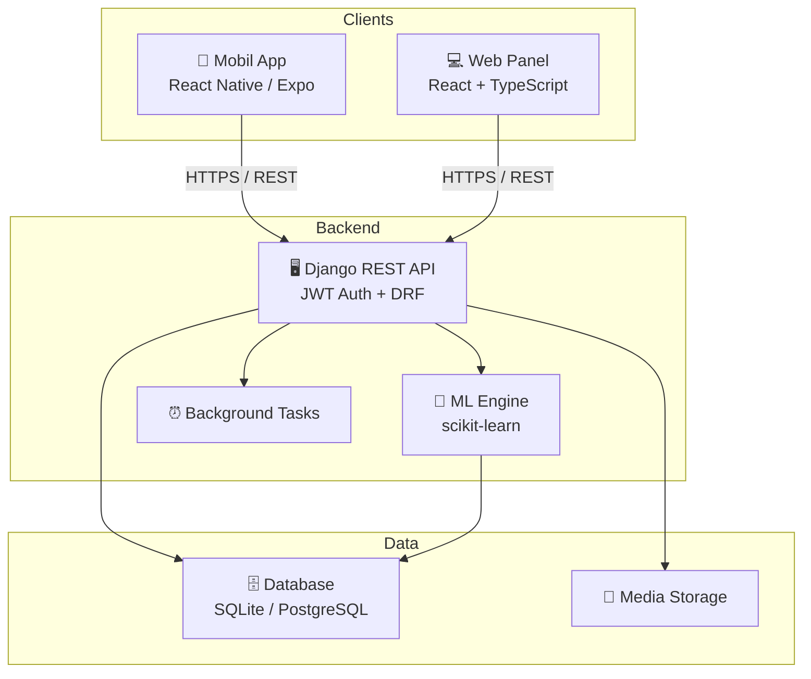

# 🏠 BekoSIRS - Smart Inventory & Recommendation System

<p align="center">
  
  
  
  
  
</p>

<p align="center">
  
</p>

Beko ürünleri için akıllı envanter yönetimi, kişiselleştirilmiş ürün önerileri ve servis takip sistemi.

---

## 📋 İçindekiler

- [Özellikler](#-özellikler)
- [Teknoloji Stack](#-teknoloji-stack)
- [Kurulum](#-kurulum)
- [Kullanım](#-kullanım)
- [API Dokümantasyonu](#-api-dokümantasyonu)
- [Proje Yapısı](#-proje-yapısı)

---

## ✨ Özellikler

### 📱 Mobil Uygulama (React Native / Expo)
- 🔐 JWT tabanlı kimlik doğrulama
- 👆 Biyometrik giriş (Face ID / Touch ID)
- 🛒 Ürün listeleme ve arama
- ❤️ İstek listesi yönetimi
- 🔔 Push bildirimleri
- 🔧 Servis talepleri oluşturma
- 🎯 Kişiselleştirilmiş ürün önerileri (ML)

### 💻 Web Panel (React + TypeScript)
- 👥 Kullanıcı yönetimi ve rol ataması
- 📦 **Kategori Yönetimi:** Tablo görünümü ile hızlı düzenleme
- ⭐ **Değerlendirme Yönetimi:** Liste görünümü ve detay paneli ile hızlı onay/red
- 🔧 **Servis Talepleri:** Sekmeli yapı (Aktif/Geçmiş) ve gelişmiş filtreleme
- 🚚 Teslimat yönetimi ve rota optimizasyonu
- 📢 Toplu bildirim gönderimi
- 📊 Dashboard ve profesyonel istatistik grafikleri

### 🤖 ML Tabanlı Öneri Sistemi
Üç katmanlı hibrit öneri motoru (900+ satır):
- **Neural Collaborative Filtering (NCF):** MLP sinir ağı (64→32→16 katman), kullanıcı-ürün etkileşimlerini öğrenir
- **Content-Based Filtering:** TF-IDF + cosine similarity ile ürün içerik benzerliği
- **Popularity-Based Fallback:** Yeni kullanıcılar için cold-start çözümü
- **Ağırlıklı Ensemble:** NCF %40 + Content %40 + Popularity %20
- Tıklama, görüntüleme, favoriler ve satın alım verileri ile otomatik model güncelleme

### 🖥️ Backend API (Django REST Framework)
- 🔑 JWT Authentication + Token Refresh
- 👤 Kullanıcı profil ve adres yönetimi (KKTC'ye özel)
- 📦 Ürün CRUD + Excel export/import
- 🔔 Bildirim sistemi (fiyat düşüşü, garanti hatırlatma, gecikmiş taksit)
- 🤖 Hibrit ML öneri sistemi (NCF + Content-Based + Popularity)
- 🧾 Taksit planları ve gecikme tespiti
- 🔒 4 rol tabanlı yetkilendirme (admin, seller, customer, delivery)

---

## 🏗️ Mimari



## 🛠️ Teknoloji Stack

| Katman | Teknoloji |
|--------|-----------|
| **Backend** | Python 3.11+, Django 5.x, Django REST Framework |
| **Web Panel** | React 18, TypeScript, Vite, Axios |
| **Mobile App** | React Native, Expo, TypeScript |
| **Database** | Supabase PostgreSQL |
| **Auth** | JWT (djangorestframework-simplejwt) |
| **ML** | scikit-learn, DeepFace (Face ID), pandas |
| **CI/CD** | GitHub Actions (backend + web + mobile) |

---

## 🚀 Kurulum

### Gereksinimler

- Python 3.11+
- Node.js 18+
- npm veya yarn
- Expo CLI

### Hızlı Başlangıç

Tüm servisleri tek komutla başlatmak için:

```bash
chmod +x start-all.sh
./start-all.sh
```

### Manuel Kurulum

#### 1️⃣ Backend API

```bash
cd BekoSIRS_api

# Virtual environment oluştur
python -m venv venv
source venv/bin/activate  # Windows: venv\Scripts\activate

# Bağımlılıkları yükle
pip install -r requirements.txt

# .env dosyasını oluştur ve düzenle
cp .env.example .env
# Gerekli değişkenler: SECRET_KEY, DB_ENGINE, DB_NAME, DB_USER, DB_PASSWORD, DB_HOST, DB_PORT

# Migration'ları çalıştır
python manage.py migrate

# Superuser oluştur
python manage.py createsuperuser

# Sunucuyu başlat
python manage.py runserver 0.0.0.0:8000
```

#### 2️⃣ Web Panel

```bash
cd BekoSIRS_Web

# Bağımlılıkları yükle
npm install

# Development sunucusunu başlat
npm run dev -- --host
```

Web Panel: [http://localhost:5173](http://localhost:5173)

#### 3️⃣ Mobile App

```bash
cd BekoSIRS_Frontend

# Bağımlılıkları yükle
npm install

# .env dosyasını oluştur
cp .env.example .env

# Expo'yu başlat
npx expo start
```

---

## 📖 Kullanım

### Web Panel Erişimi
- URL: `http://localhost:5173`
- Admin: Oluşturduğunuz superuser bilgileri

### Mobil Uygulama
- iOS Simulator: `.env` dosyasında `EXPO_PUBLIC_API_URL=http://localhost:8000/api/v1/`
- Android Emulator: `EXPO_PUBLIC_API_URL=http://10.0.2.2:8000/api/v1/`
- Fiziksel Cihaz: Bilgisayarınızın IP adresini kullanın

### Startup Script Seçenekleri

```bash
./start-all.sh                # Tüm servisleri başlat
./start-all.sh --backend-only # Sadece backend
./start-all.sh --web-only     # Sadece web panel
./start-all.sh --mobile-only  # Sadece mobil app
./start-all.sh --stop         # Tüm servisleri durdur
```

---

## 📚 API Dokümantasyonu

### Swagger UI (İnteraktif)
Sunucu çalışırken tarayıcıdan erişin:
```
http://localhost:8000/api/schema/swagger-ui/
```

### Base URL
```
http://localhost:8000/api/v1/
```

### Ana Endpointler

| Endpoint | Method | Açıklama |
|----------|--------|----------|
| `/token/` | POST | JWT token al |
| `/token/refresh/` | POST | Token yenile |
| `/users/` | GET, POST | Kullanıcı işlemleri |
| `/products/` | GET, POST | Ürün işlemleri |
| `/categories/` | GET, POST | Kategori işlemleri |
| `/reviews/` | GET, POST | Değerlendirmeler |
| `/service-requests/` | GET, POST | Servis talepleri |
| `/notifications/` | GET, POST | Bildirimler |
| `/deliveries/` | GET, POST | Teslimatlar |
| `/recommendations/` | GET | Kişisel ML önerileri |
| `/installment-plans/` | GET, POST | Taksit planları |
| `/biometric/login/` | POST | Yüz tanıma ile giriş |

Tam endpoint listesi için Swagger UI: `http://localhost:8000/api/schema/swagger-ui/`

---

## 📁 Proje Yapısı

```
BekoSIRS/
├── BekoSIRS_api/          # Django Backend
│   ├── bekosirs_backend/  # Django settings
│   ├── products/          # Ana uygulama
│   │   ├── views/         # Modüler view'lar
│   │   ├── models.py      # Veritabanı modelleri
│   │   ├── serializers.py # API serializers
│   │   └── urls.py        # URL routing
│   └── requirements.txt
│
├── BekoSIRS_Web/          # React Web Panel
│   ├── src/
│   │   ├── components/    # React bileşenleri
│   │   ├── pages/         # Sayfa bileşenleri
│   │   └── services/      # API servisleri
│   └── package.json
│
├── BekoSIRS_Frontend/     # Expo Mobile App
│   ├── app/               # Expo Router sayfaları
│   ├── components/        # React Native bileşenleri
│   ├── services/          # API servisleri
│   └── package.json
│
├── start-all.sh           # Unified startup script
└── README.md              # Bu dosya
```

---

## 🧪 Test

### Backend Testleri
```bash
cd BekoSIRS_api
python -m pytest
```

### Web Panel Testleri
```bash
cd BekoSIRS_Web
npm test
```

---

## 👥 Katkıda Bulunma

1. Bu repoyu fork edin
2. Feature branch oluşturun (`git checkout -b feature/yeni-ozellik`)
3. Değişikliklerinizi commit edin (`git commit -m 'feat: yeni özellik eklendi'`)
4. Branch'i push edin (`git push origin feature/yeni-ozellik`)
5. Pull Request açın

---

## 📄 Lisans

Bu proje eğitim amaçlı geliştirilmiştir.

---

<p align="center">
  Made with ❤️ for BekoSIRS
</p>
